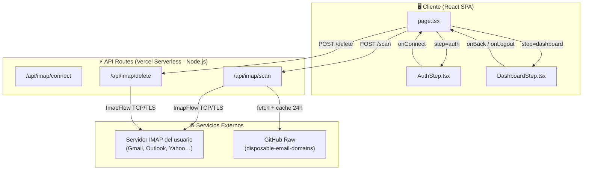

# 🏗️ ZeroTrace — Estructura de la Aplicación

> **Auditoría técnica · Marzo 2026**
> Versión del análisis: MVP 0.1.0 · Next.js 14 (App Router) · Vercel Serverless

---

## 1. Árbol de Ficheros

```
ZeroTrace/
├── app/                        ← Next.js 14 App Router
│   ├── api/imap/
│   │   ├── connect/route.ts    (93L)  — Endpoint de verificación de credenciales
│   │   ├── scan/route.ts       (235L) — Escaneo IMAP: Clan + Pueblos + Hub + Spam
│   │   └── delete/route.ts     (77L)  — Mover correos a Papelera vía IMAP
│   ├── fonts/                  — (vacío, fuentes vía Google Fonts CDN)
│   ├── globals.css             (52L)  — Base layer + glass-panel utilities
│   ├── layout.tsx              (50L)  — RootLayout: SEO, PWA manifest, Google Fonts
│   ├── page.tsx                (109L) — Componente raíz SPA (orquesta auth ↔ dashboard)
│   └── favicon.ico
│
├── components/
│   ├── AuthStep.tsx            (267L) — Paso de autenticación (landing + form + modal)
│   └── DashboardStep.tsx       (814L) — Panel de limpieza (accordion 4 paneles + modales)
│
├── public/
│   ├── img/icono-zerotrace.png (1.7 MB) — Icono PWA
│   └── manifest.json           — Web App Manifest (standalone)
│
├── .context/
│   └── PRD_y_Arquitectura.md   — Documento de referencia del PRD
│
├── docs/                       — Documentación de auditoría (este directorio)
│
├── next.config.mjs             — Configuración Next.js (vacía, defaults)
├── tailwind.config.ts          — Tokens: primary, background-light/dark, font display
├── tsconfig.json               — TypeScript strict mode, bundler resolution
├── postcss.config.mjs          — Plugins Tailwind + Autoprefixer
├── package.json                — Dependencias (imapflow, next, react)
├── .eslintrc.json              — Extends next/core-web-vitals + next/typescript
└── .gitignore
```

**Total de código fuente:** ~1697 líneas en 8 ficheros.

---

## 2. Arquitectura de Alto Nivel



---

## 3. Modelo de Datos (In-Memory Only)

| Entidad | Origen | Tipo | Campos Clave |
|---|---|---|---|
| `ClanRemitente` | `/api/imap/scan` | Agrupación por `from` | `email`, `count`, `uids[]`, `sizeBytes` |
| `PuebloFantasma` | `/api/imap/scan` | Mensajes > 2 años | `email`, `subject`, `date`, `uid`, `sizeBytes` |
| `HubDesuscripcion` | `/api/imap/scan` | Tiene `List-Unsubscribe` | `name`, `email`, `listUnsubscribe`, `uids[]`, `sizeBytes` |
| `SpamGroup` | `/api/imap/scan` | Dominio en blocklist | `email`, `name`, `count`, `totalSize`, `ids[]` |
| `ScanData` | React state | Contenedor | `{ clan[], pueblos[], hub[], spamRadar[] }` |
| Credenciales | React state | Volátiles | `{ email, appPassword }` — nunca persisten |

> **Persistencia:** Solo `localStorage` para contadores anónimos (`zeroTraceGlobalStats`, `zeroTrace_unsubs`). No hay base de datos.

---

## 4. Flujo de las API Routes

### 4.1 `/api/imap/connect` (Legacy / Test)

1. Recibe `{ email, appPassword }` → auto-detecta IMAP host.
2. Abre conexión → lee `INBOX.exists` → cierra.
3. Devuelve `{ status, totalMessages }`.

> ⚠️ **No usado actualmente** desde el frontend. `page.tsx` llama directamente a `/scan`.

### 4.2 `/api/imap/scan`

1. Recibe `{ email, appPassword, imapHost, imapPort }`.
2. Conecta vía ImapFlow, bloquea `INBOX`.
3. En paralelo: fetch de la blocklist de dominios spam (cache 24h via `next.revalidate`).
4. Itera los últimos **2000 mensajes** solicitando solo headers (`from`, `subject`, `date`, `list-unsubscribe`) + `size`.
5. Clasifica cada mensaje en 4 Maps simultáneos.
6. Convierte Maps a Arrays, filtra `clan > 2 correos`, ordena, devuelve JSON.

### 4.3 `/api/imap/delete`

1. Recibe `{ email, appPassword, imapHost, imapPort, uids[] }`.
2. Detecta la carpeta Trash del servidor IMAP (flag `\\Trash` o fallback).
3. Usa `messageMove(uids, trashPath)` — **nunca ejecuta EXPUNGE**.
4. Devuelve `{ success, count }`.

---

## 5. Stack y Dependencias

| Categoría | Tecnología | Versión |
|---|---|---|
| Framework | Next.js | 14.2.35 |
| UI | React + TypeScript | ^18 |
| Estilos | Tailwind CSS | ^3.4.1 |
| Motor IMAP | imapflow | ^1.2.12 |
| Iconos | Material Symbols (CDN) | latest |
| Fuente | Public Sans (Google Fonts) | swap |
| PWA | manifest.json + meta tags | standalone |
| Linting | ESLint (next/core-web-vitals) | ^8 |
| Runtime | Node.js (NO Edge) | — |

**Dependencias de producción:** 3 (`imapflow`, `next`, `react`/`react-dom`).
**Dependencias de desarrollo:** 8 (tipos, eslint, postcss, tailwind, typescript).

---

## 6. Configuración de Seguridad Actual

| Aspecto | Estado |
|---|---|
| `logger: false` en ImapFlow | ✅ Evita leaks de credenciales en logs |
| Credenciales solo en React state | ✅ Nunca persisten en disco/cookies |
| Borrado vía Papelera (no EXPUNGE) | ✅ Reversible 30 días |
| `userScalable: false` en viewport | ⚠️ Accessibility concern |
| No hay rate limiting | ❌ |
| No hay CSRF protection | ❌ |
| No hay validación/sanitización de inputs | ❌ |
| Console.logs con datos sensibles | ❌ (`connect/route.ts` logea email) |
