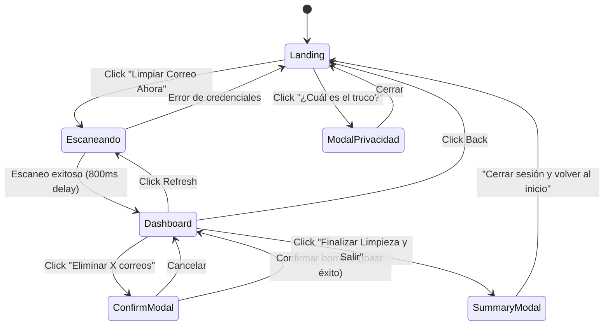

# 🧑‍💻 ZeroTrace — Experiencia de Usuario (UX Audit)

> **Auditoría UX · Marzo 2026**

---

## 1. Mapa de Navegación

---

## 2. Flujo Detallado del Usuario

### Paso 1: Landing / Auth (`AuthStep.tsx`)

| Elemento | Descripción | Evaluación |
|---|---|---|
| **Trust Badge** | "🛡️ 100% Gratis. 100% Privado." | ✅ Genera confianza inmediata |
| **Hero Copy** | "Limpia tu correo en segundos. Sin dejar rastro." | ✅ Propuesta de valor clara |
| **Contadores Globales** | Mails, Bytes, CO2, Suscripciones canceladas | ✅ Social proof efectivo |
| **Formulario** | Email + App Password con iconos Material | ✅ Clean, glassmorphism |
| **Tooltip Dinámico** | Cambia según el proveedor detectado (Gmail, Outlook…) | ✅ Excelente microinteracción |
| **CTA** | "Limpiar Correo Ahora" con icono cleaning | ✅ Acción directa y clara |
| **Link ¿Cuál es el truco?** | Abre modal de privacidad | ✅ Transparencia |
| **Feedback de Error** | Banner rojo animado con icono | ✅ Visible y no intrusivo |
| **Mensaje de Éxito** | Banner teal al volver del dashboard | ✅ Cierre del ciclo |

### Paso 2: Estado de Escaneo (dentro de `AuthStep.tsx`)

| Elemento | Descripción | Evaluación |
|---|---|---|
| **Barra de Progreso** | Animada con glow teal, porcentaje numérico | ✅ Premium feel |
| **Texto "Analizando 2000 correos"** | Fijo, no refleja el total real del buzón | ⚠️ Hardcodeado |
| **Spinner** | Material icon `refresh` con `animate-spin` | ✅ Visual claro |
| **Copy de privacidad** | "Ningún correo se guarda en disco" | ✅ Refuerzo del brand |

### Paso 3: Dashboard (`DashboardStep.tsx`)

| Elemento | Descripción | Evaluación |
|---|---|---|
| **Header Sticky** | Back + Refresh + "Finalizar y Salir" | ✅ Accesible siempre |
| **Estado del Escaneo (card)** | "Limpieza Lista · 100% · X correos identificados" | ✅ Contexto claro |
| **Acordeón 4 paneles** | Clan / Pueblos / Hub / Spam Radar | ✅ Organización lógica |
| **Tooltips informativos** | En cada panel con explicación contextual | ✅ Onboarding inline |
| **Badges de conteo** | Chips teal con total por categoría | ✅ Scaneo visual rápido |
| **Items con checkbox** | Nombre, email, conteo, tamaño por remitente | ✅ Info suficiente |
| **Botón Desuscribir** | Solo en Hub, con estados (sin baja / desuscrito ✓) | ✅ Workflow inteligente |
| **Footer fijo** | Botón global de eliminación con resumen dinámico | ✅ Siempre accesible |
| **Disclaimer** | "Los correos solo se moverán a tu Papelera" | ✅ Reduce ansiedad |

### Paso 4: Confirmación de Borrado (Modal)

| Elemento | Descripción | Evaluación |
|---|---|---|
| **Icono Warning** | Grande, rojo, centrado | ✅ Gravedad visual clara |
| **Copy de recoverable** | "Podrás recuperarlos… 30 días" | ✅ Reduce miedo |
| **Botón Confirmar** | Rojo, con estado loading ("Borrando…") | ✅ Feedback durante operación |
| **Botón Cancelar** | Discreto pero accesible | ✅ |

### Paso 5: Resumen de Sesión (Modal)

| Elemento | Descripción | Evaluación |
|---|---|---|
| **Icono trofeo** | Con glow gradient de celebración | ✅ Dopamine hit |
| **Métricas de sesión** | Correos eliminados, MB, CO2, Newsletters | ✅ Gamification |
| **"Recordarme en 30 días"** | Descarga fichero .ics para calendario | ✅ Retención innovadora |
| **CTA de cierre** | Gradiente teal → emerald, con icono logout | ✅ Cierre premium |

---

## 3. Evaluación de Puntos Fuertes

| # | Fortaleza | Detalle |
|---|---|---|
| 1 | **Glassmorphism consistente** | Todos los paneles usan `bg-white/10 + backdrop-blur-lg`. Cohesivo y premium. |
| 2 | **Micro-animaciones** | `animate-in`, `fade-in`, `slide-in-from-top`, `zoom-in` en modales y listas. |
| 3 | **Tooltips contextuales** | Se adaptan al proveedor de correo y a cada panel del acordeón. |
| 4 | **Feedback constante** | Toast, banners, spinners, barras de progreso — el usuario nunca está "a oscuras". |
| 5 | **Safe delete pattern** | Confirma → mueve a Papelera → informa de recuperabilidad. |
| 6 | **Descarga .ics** | Estrategia de retención elegante sin necesidad de notificaciones push. |
| 7 | **Mobile-first** | `max-w-xl` / `max-w-2xl`, diseño responsive, footer fijo. |

---

## 4. Puntos Débiles y Friction Points

| # | Problema | Impacto | Severidad |
|---|---|---|---|
| 1 | **Texto "Analizando 2000 correos" hardcodeado** | El usuario puede tener 50 o 50.000 correos, y ve siempre "2000". Pierde confianza. | 🟡 Medio |
| 2 | **Barra de progreso fake** | El avance es aleatorio (`Math.random`), no refleja el escaneo real. El salto abrupto a 95%→100% delata que no es real. | 🟡 Medio |
| 3 | **No hay indicador de "0 resultados" global** | Si los 4 paneles salen vacíos, no hay mensaje tipo "Tu bandeja está limpia 🎉". | 🟡 Medio |
| 4 | **El panel de Pueblos Fantasma muestra 1 mail por fila** | No hay agrupación por año ni paginación. Con 500+ resultados, el scroll es eterno. | 🟠 Alto |
| 5 | **Sin "Seleccionar todo" por panel** | Para borrar 200 remitentes del Clan hay que marcarlos uno a uno. | 🟠 Alto |
| 6 | **Sin búsqueda/filtro dentro de paneles** | Imposible encontrar un remitente concreto en listas largas. | 🟡 Medio |
| 7 | **Sin paginación ni virtualización** | 2000 DOM nodes renderizados a la vez = lag en dispositivos de gama baja. | 🟠 Alto |
| 8 | **El botón "Desuscribir" abre una nueva pestaña externa** | El usuario pierde contexto; no se confirma automáticamente si la desuscripción fue exitosa. | 🟡 Medio |
| 9 | **No hay dark/light mode toggle** | El diseño es dark-only. Usuarios con preferencia de light mode ven siempre oscuro. | ⚪ Bajo |
| 10 | **Copyright "2024" desactualizado** | Footer dice `© 2024 ZeroTrace` — debería ser dinámico. | ⚪ Bajo |
| 11 | **`userScalable: false`** | Impide zoom en móvil, lo cual es un problema de accesibilidad (WCAG). | 🟡 Medio |
| 12 | **Sin onboarding post-scan** | Al llegar al Dashboard todos los paneles están cerrados. Un usuario nuevo no sabe que debe expandirlos y marcar checkboxes. | 🟡 Medio |
